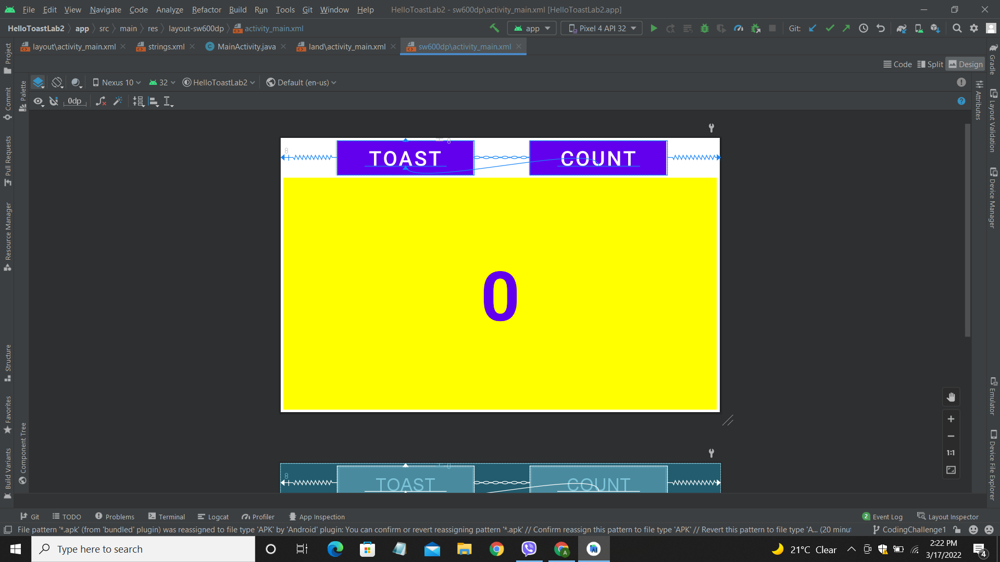

# Lab 2: Coding Challenge

**This is the Coding Challenge section for Lab 2. The code and the screenshot for the task are provided within this branch.**

---

## Arranging the buttons

**The screenshot above shows the buttons being arranged in the space evenly. This was done by shift selecting both buttons and
using the align button from the toolbar to center them horizontally.**