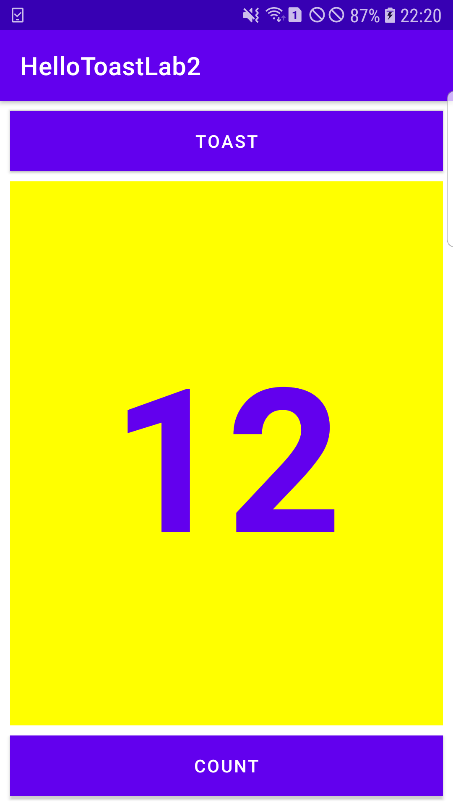

# Task 2: Change the Layout to LinearLayout

**In this task, the layout of the created app was changed from ConstraintLayout to LinearLayout. The codes for the task along
with the screenshot are provided here.**

---

## The final app

**The screenshot above shows the UI of the final app that was created after changing the layout to LinearLayout.**