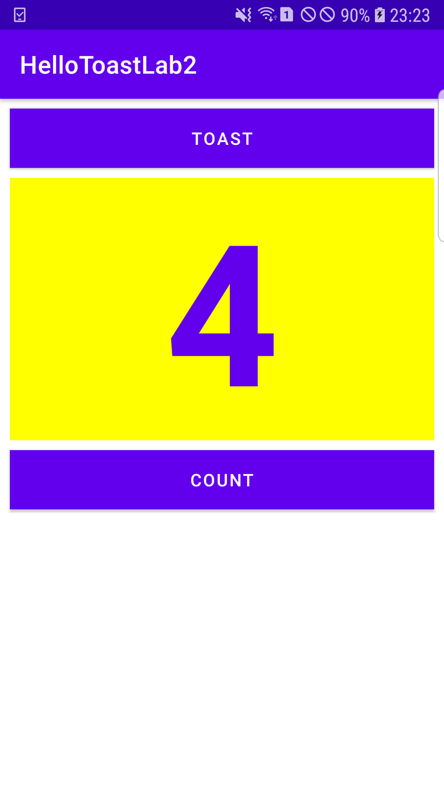

# Task 3: Changing the Layout to RelativeLayout

**This branch consists of the codes and screenshot for the 'Task 3' section of Lab 2.**

---

## The UI:

**The screenshot above shows the final UI of the app created in the task 3 of lab 2. The layout was changed from LinearLayout
to RelativeLayout and the app was run in a physical device.**