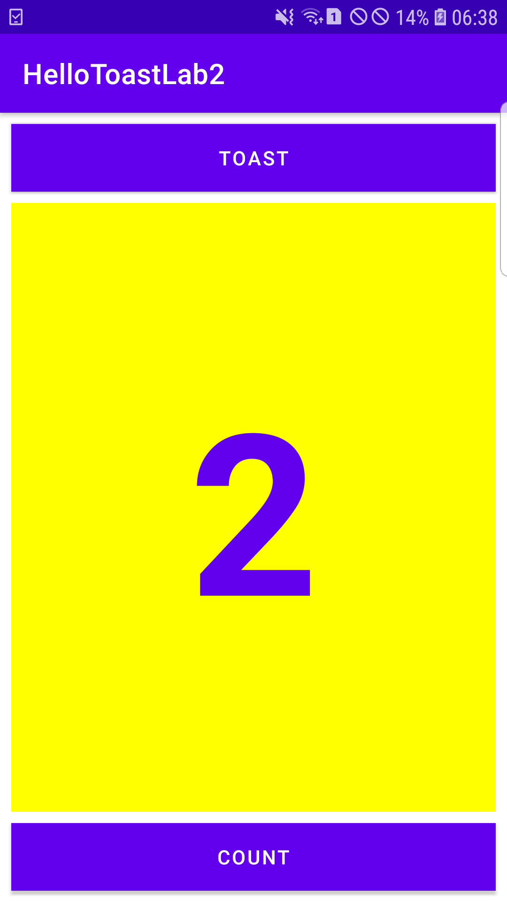
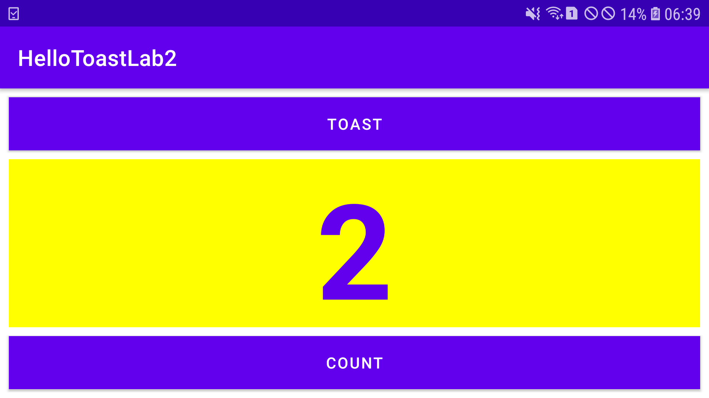
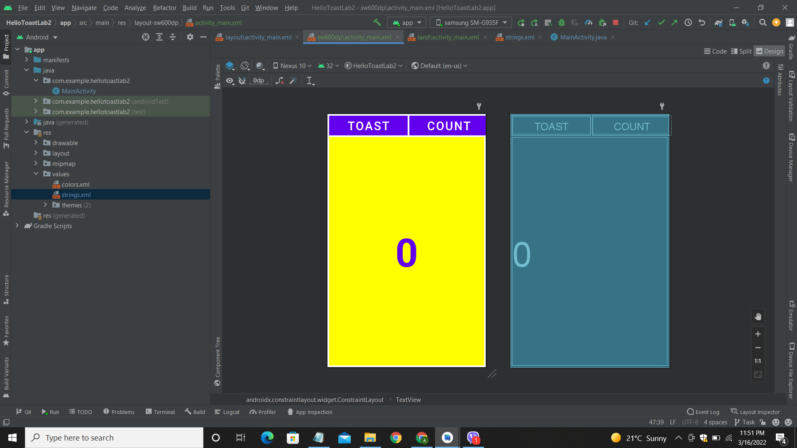
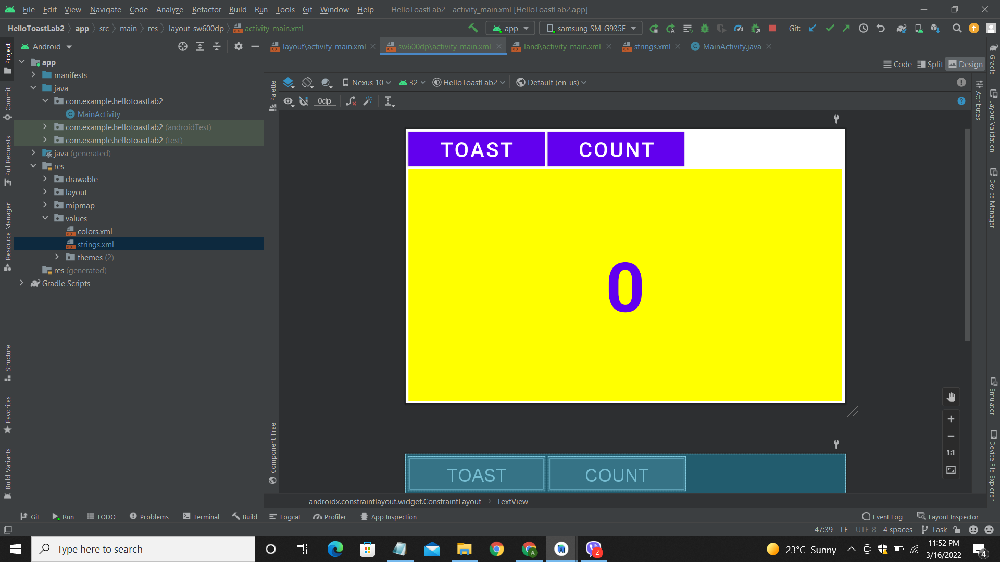

# Lab 2: Task 1

## Creating Layout Variants

**This branch consists of task 1 for the lab 2 of DMA module. The codes for the respective tasks are provided in this branch along
with the screenshots. The main task was to create layout variants for different views and devices.**

---

### Portrait Mode

**The above screenshot shows the final app for the lab 2 that is similar to the final app created in lab 1. There are two buttons
; Toast and Count buttons along with a text view to show the count value. The app was run in portrait mode in a physical
device.**

--- 

### Landscape Mode

**The above screenshot shows the final app running in landscape mode in a physical device. It was done by creating a landscape 
layout variation from the existing vertical variation.**

--- 

### Tablet Portrait Mode

**The above screenshot shows the final app layout variation for tablets being executed in portrait mode. In this task, 'Baseline
Constraint' was used for arranging the buttons and they were expanded horizontally as well.**

--- 

### Tablet Landscape Mode

**The above screenshot shows the final app layout variation for tablets being executed in landscape mode.**
