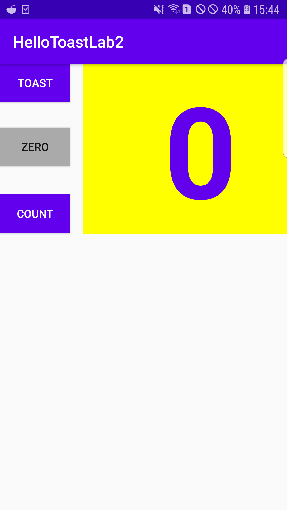

# Lab 2: Homework Section

**This is the homework section for lab 2 and the codes and screenshots for every tasks are provided below.**

---

## The UI

**The screenshot above shows the final UI of the app that was created in this exercise. The UI consists of 3 buttons and a 
text view. The 'Toast' button displays a toast message and the 'Count' button increases the counter value in the text view.
Similarly, the 'Zero' button sets the counter value to 0 when pressed.**

---

## Count Button Feature

**This is the feature that is added to the count button where the background color of the button is set to Green when
the counter value is 'even' and the color is set to black when the counter value is 'odd'.**

**The background color of the count button is set to green when the count value is even.**

**The background color of the count button is set to black when the count value is odd.**

---

## Zero Button Feature

**This is the feature included with the zero button of the app. The background color of the button is set to teal when the
counter value is greater than 1 or when it is active and when it is pressed the value is set to 0 along with the change in its background color to what it
was before.**

**The background color of the zero button is set to teal referring that it is active.**

**The background color of the zero button is set to the original color when it is pressed. The count value is also set to 0.**

---

## Landscape View

**The landscape view for the final app was also created in this task. The screenshots below show the landscape view created for
the final app with all the features that were available in the portrait view of the app.**

**The Landscape UI for the final app.**

**The Count button feature for the even values.**

**The Count button feature for the odd values.**

---

## Tablet(xlarge) View

**The tablet view for the final app was also created in this task. The screenshot below shows the tablet view created for
the final app that accommodates all the features that were available in the portrait view of the app.**

**The tablet(xlarge) UI for the final app.**
